[原文地址](http://www.linuxidc.com/Linux/2014-04/100369.htm)  
window系统下，划分出磁盘空间，50G以上吧，然后在电脑-管理-磁盘管理，`格式化`并`删除卷`  
此分区用于安装linux系统及其文件，删除卷后，此分区对window系统不可见，但linux下，全盘可见
#### 准备工具[EasyBCD软件](http://easybcd.soft32.com/free-download/)和[Ubuntu的iso镜像](http://www.linuxidc.com/Linux/2014-04/100352.htm)
下面打开EasyBCD软件，可以看到现在我们的计算机只有一个启动“入口”，我们来给他加一个，第一步选择添加新条目（添加移动入口点）  
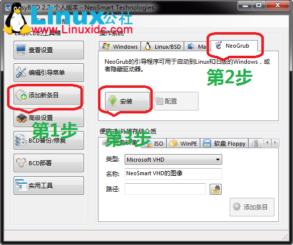  
第2步选NeoGrub，第3步点安装点保存 ，接着是配置（第4步）  
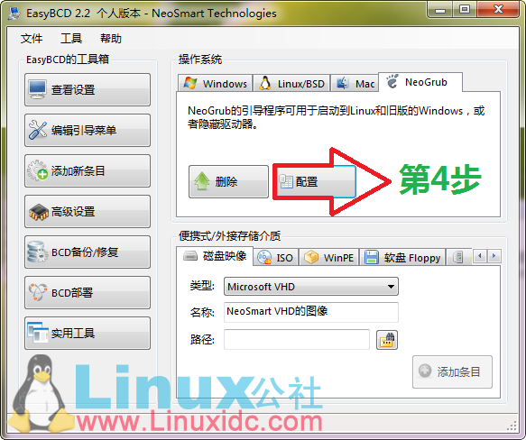  
然后就会出现一个menu.lst文件  
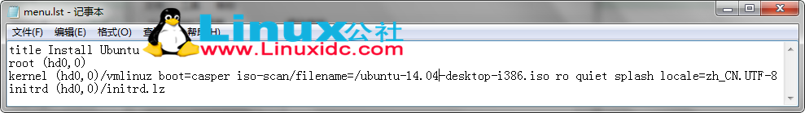  
把下面的 英文 复制进去，把原来的全覆盖掉
```txt
title Install Ubuntu
root (hd0,0)
kernel (hd0,0)/vmlinuz boot=casper iso-scan/filename=/ubuntu-14.04-desktop-i386.iso ro quiet splash locale=zh_CN.UTF-8
initrd (hd0,0)/initrd.lz
```
特别注意，ubuntu-14.04-desktop-i386.iso是你的`iso的名字`  
下面把准备好的Ubuntu iso镜像文件用压缩软件或者虚拟光驱打开，找到casper文件夹，把里面的initrd.lz和vmlinuz解压到C盘，把.disk文件夹也解压到C盘，然后在把整个iso文件复制到C盘。  
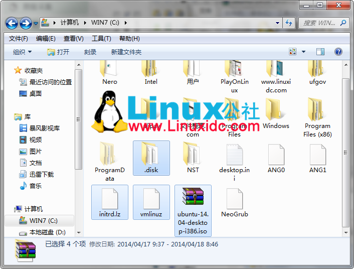  
`重启` 你就会看到有2个 启动菜单给你选择 我们选择 `NeoGrub 引导加载器` 这个选项  
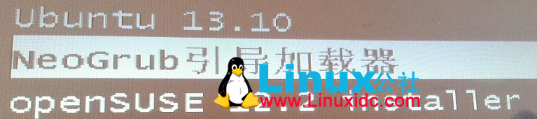  
然后稍等待一段时间 就会见到我们想要安装的 Ubuntu了  
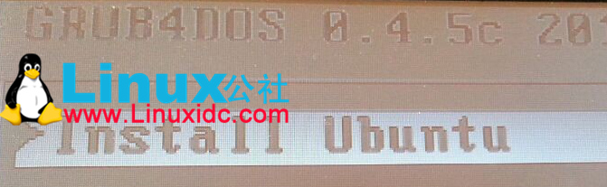  
进入桌面后，按 `Ctrl+Alt+T` 打开终端，输入代码:  
```txt
sudo umount -l /isodevice
```
这一命令取消掉对光盘所在 驱动器的挂载（注意，这里的-l是L的小写，-l 与 /isodevice 有一个空格。），否则分区界面找不到分区。  
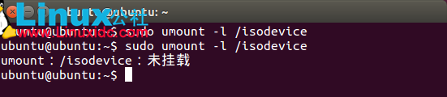  
下面就点击 安装Ubuntu 14.04开始安装，选语言不用说  
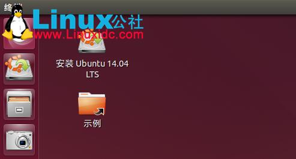  
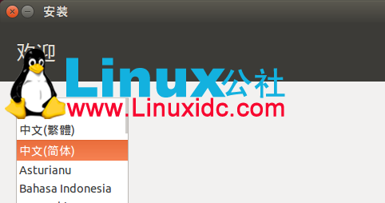  
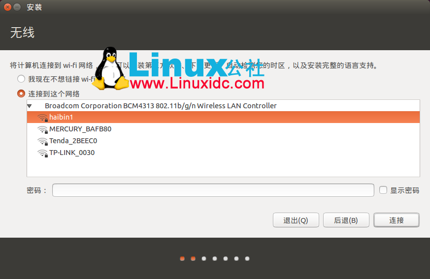  
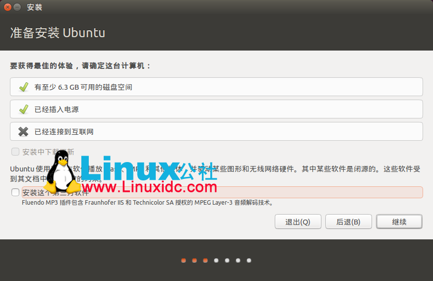  
磁盘分区，看个人情况  
```txt
SWAP  8G       (交换空间) 
/     50G ext4（根分区）
```
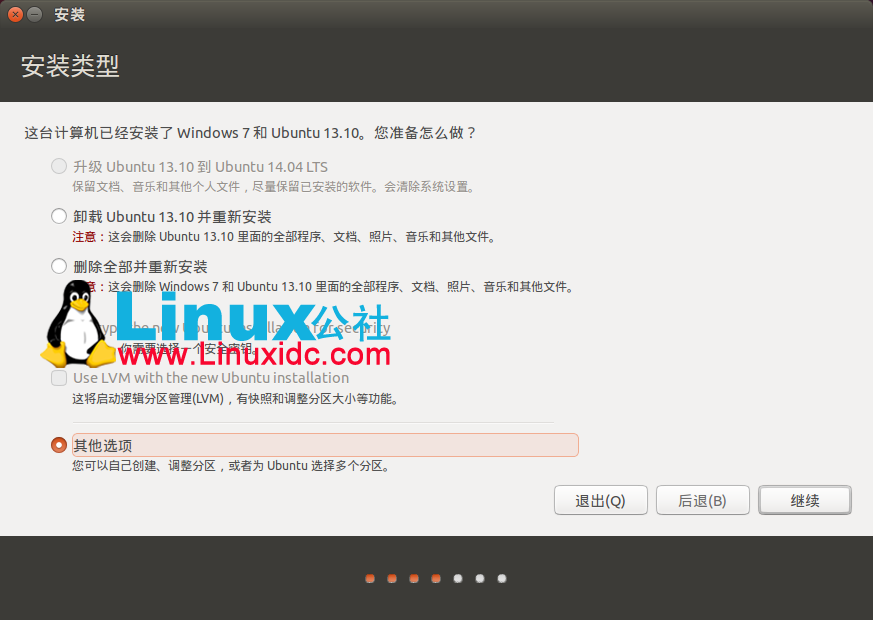  
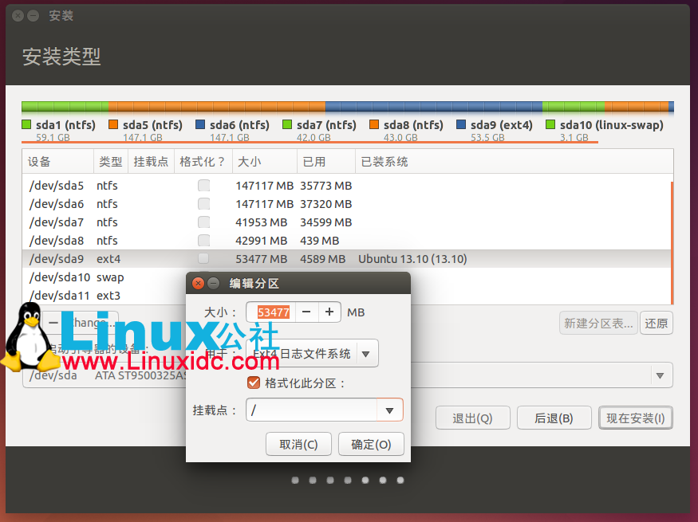  
有的说自动联网的，最好拔下网线，安装过程中会下载语言包等文件，会要一些时间，认为可以安装好后再下载，有空的就联网安装吧。这里选择不联网安装。  
部分安装图：  
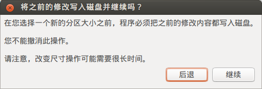  
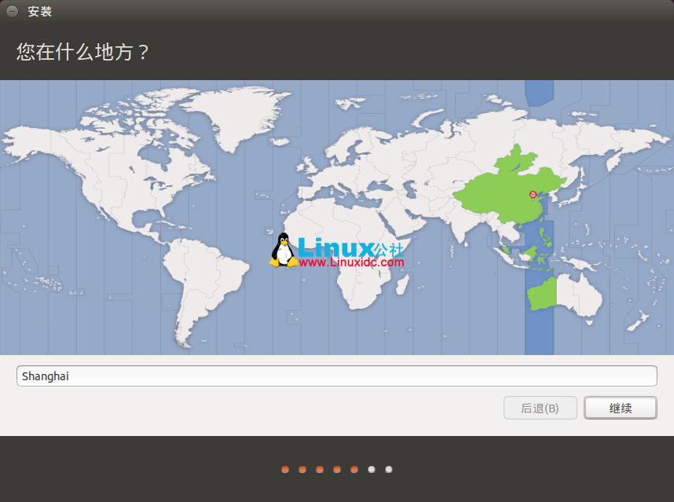  
下面的安装选择默认吧，不要改动什么  
  
点击 现在重启 即可。  
### 注意
```txt
(1)在选择安装启动引导器的设备时，可以选择我们分好的 / 区，也可以新建一个/boot区。

(2)若重启就会发现原来 Windows进不去了。

打开终端输入命令

sudo gedit /etc/default/grub

修改GRUB_TIMEOUT="10"
然后在终端中输入sudo update-grub
update 命令会自动找到 windows 7 启动项。并且自动更新 /boot/grub/grub.cfg 文件。这样重启就能进windows了。

(3)最后进入Windows 7，打开EasyBCD删除安装时改的menu.lst文件，按Remove即可。

然后去我们的c盘 删除vmlinuz，initrd.lz和系统的iso文件。

利用EasyBCD可以更改启动项菜单按Edit Boot Menu按钮，可以选择将Windows7设为默认开机选项。
```
